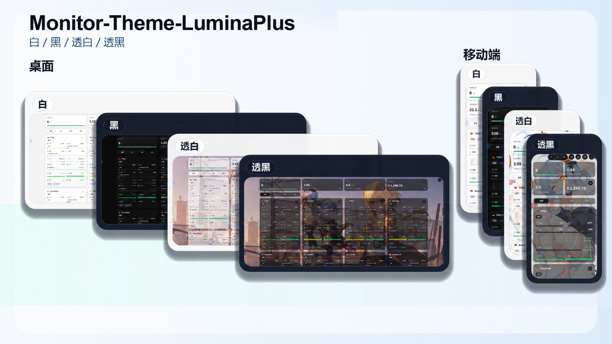

# monitor-theme-luminaplus

LuminaPlus 是为 [monitor](https://github.com/monitor-probe/monitor) 移植的独立公开状态主题，保留原版 LuminaPlus 的高信息密度卡片、响应式布局、资源图表、流量统计、资产统计和背景外观能力。

本项目基于 [Komari-Theme-LuminaPlus](https://github.com/shanyang242/Komari-Theme-LuminaPlus) 移植，并继续遵循 MIT 许可证。



## 当前能力

- 大卡片、小卡片、迷你卡片和列表四种节点视图
- monitor `/api/ws` 实时节点快照，断线时自动回退 HTTP
- CPU、内存、Swap、磁盘、负载、网络和连接数实时指标
- CPU、内存、磁盘和网络历史图表
- 多探测点 Ping 延迟与丢包历史图表
- 今日流量、速率历史和峰值统计
- 费用、账单周期、到期时间和资产统计
- 国家地区筛选、亮色/暗色外观、背景图片、桌面视频和环境动效
- 桌面、平板和移动端布局

## 当前限制

- 主题设置暂时保存在当前浏览器的 `localStorage`，不会同步到其他访客或设备。
- monitor 目前没有公开分组、标签和公开备注字段，相应筛选项在无数据时自动隐藏。
- monitor 不向匿名主题下发 IP 地址；本主题不依赖额外的 IP 信息插件。
- monitor 历史接口目前不提供 Swap、连接数、进程数和 Load 历史，这些指标仍可显示实时值。
- 首页 Ping 需要在主题设置中绑定 monitor 的探测任务；节点详情页可直接读取已分配探测任务的历史。

## 开发

准备一个运行在 `127.0.0.1:9911` 的 monitor hub：

```bash
npm ci
npm run dev
```

Vite 会把 `/api` 和 WebSocket 请求代理到 hub。

提交前运行：

```bash
npm run typecheck
npm run lint
npm test
npm run build
```

## 打包与安装

生成 monitor 可安装的主题包：

```bash
npm run package
```

产物为仓库根目录下的 `theme.tar.gz`，内部结构为：

```text
dist/
theme.json
preview.png
```

在 monitor 后台的「主题」页面上传 `theme.tar.gz`，然后选择 LuminaPlus。

也可以手动解压到 hub 的主题目录：

```text
<themes-dir>/LuminaPlus/
├── theme.json
├── preview.png
└── dist/
    └── index.html
```

## 自定义背景资源

把图片或视频放入 `public/assets/`，重新执行 `npm run package`，然后在主题设置中填写 `/assets/<文件名>`。

桌面视频建议使用短循环、无音轨的 H.264 MP4 或兼容 WebM。触屏设备、窄屏、减少动态效果和省流量模式会自动使用背景图片。

## 致谢

- [shanyang242/Komari-Theme-LuminaPlus](https://github.com/shanyang242/Komari-Theme-LuminaPlus)
- [stqfdyr/komari-theme-Lumina](https://github.com/stqfdyr/komari-theme-Lumina)
- [monitor-probe/monitor](https://github.com/monitor-probe/monitor)
- [monitor-probe/monitor-theme-default](https://github.com/monitor-probe/monitor-theme-default)

## 许可证

MIT。分发修改版本时请保留原项目及本项目的版权和许可声明。
